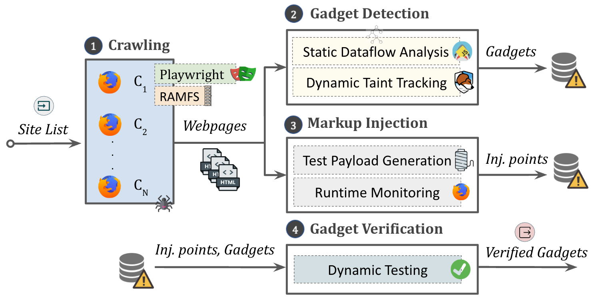

# Artifact: In the DOM We Trust



## Introduction

This artifact provides a static and dynamic pipeline to detect and verify DOM gadget vulnerabilities in web applications.
A DOM gadget vulnerability occurs when a JavaScript program selects a node from the DOM tree using a specific DOM selector, retrieves the value of a property from the selected node, and then uses this value in a security-sensitive operation without proper validation, enabling attackers to executerbitrary code or perform unintended operations.
To detect this vulnerability, we employ static and dynamic taint tracking.
This artifact builds upon and extends the functionality of [JAW](https://github.com/SoheilKhodayari/JAW) and [Foxhound](https://github.com/SAP/project-foxhound).

To demonstrate the functionality of the artifact, we will use a sample application with DOM gadget vulnerabilities running on localhost.
This README guides you through the process of setting up the environment, running the crawler, executing the analysis, and validating the results.

## Table of Contents

- [crawler](./crawler): the playwright-based crawler used to conduct our web crawling
- [dynamic verification](./dynamic_verification): dynamic verification pipeline for DOM gadgets. Automatically validates gadget data flows by monitoring sinks, generating markup matching the gadgets selector, and inserting it into the HTTP response.
- [exploit generator](./exploit_generator): exploit generator for markup injection vulnerabilities
- [exploit validator](./exploit_validator): validates the markup injection exploits by observing if the generated payload reaches the DOM
- [export service](./export_service): the database that collected taint flows are written to
- [Foxhound](./foxhound): compiled version of [Foxhound](https://github.com/SAP/project-foxhound) used for our analysis, with added support for DOM gadget flows. Our patches have since been merged into the upstream repository.
- [JAW](./JAW): a [fork of JAW](https://github.com/SoheilKhodayari/JAW) with added support for DOM-to-sink flows
- [sample application](./sample_application): a simple application with DOM gadget vulnerabilities, will be used to demonstrate functionality
- [script gadget benchmark](./script_gadget_benchmark): a benchmark of known script gadget vulnerabilities, developed during the shepherding process.

## Setting up the Environment

This artifact was tested on machine with 8 cores and 16G RAM running Ubuntu 22.04.3 LTS.

### System Requirements
- x86_64 Linux system (Required by provided version of Foxhound)
    - A foxhound build for Mac [exists](https://github.com/SAP/project-foxhound/releases/download/v128.0/foxhound-128.0.en-US.macos-13.dmg) but has not been tested
- Python 3.12.3
    - pip, venv
- nodejs v22.18.0
- Docker
- openjdk-11-jdk
- Neo4j 3.5 ([helper script](./JAW/installation/linux_neo4j_installation.sh))

### Setup and Start Sample Application

The sample application contains two DOM gadget vulnerabilities: the first one is a markup injection gadget, the second one is an asynchronous request gadget.
In addition, the application contains a markup injection vulnerability, allowing an attacker to exploit the gadgets by injecting malicious markups via the `inject` query parameter.
The vulnerable code can be found in [index.html](./sample_application/index.html)

The sample HTTP Server runs on port 80 on localhost. Thus, it must be started with root privileges.
In a separate terminal window, run the following commands:
```bash
sudo -i
cd sample_application
python3 -m venv .venv
source .venv/bin/activate
pip install -r requirements.txt
python3 server.py
```

### Setup Crawling & Dynamic Analysis
```bash
cd crawler
npm install
cd patches
./apply.sh
cd ..

cd exploit_generator
npm install
cd ..

cd exploit_validator
npm install
cd patches
./apply.sh
cd ../..
```

### Setup JAW
```bash
cd JAW
./install.sh
cd ..
```

The script will install Java 11. To install Neo4j, run the following command:
```bash
./JAW/installation/linux_neo4j_installation.sh
```

### Setup Dynamic Verification
```bash
cd dynamic_verification
npm install
cd ..
```

## Crawling

First, start the export service in a separate terminal window:
```bash
cd export_service
docker compose up
```
The docker compose command starts a MySQL and a MongoDB database that store the results of the crawling and dynamic analysis steps.

Next, seed the database with the URLs to be crawled (in this case only `http://localhost`). Afterward, start the crawler:
```bash
cd crawler
./dom_seed.sh
./dom_run_all.sh
```

Expected Outputs:
```
ID: 0/1
DB: 127.0.0.1:3306
Modules: snapshoter
Task: seed
====================
All done.
```
```
crawl 0
FOXHOUND_PATH=../foxhound/foxhound node --max-old-space-size=8192 main.js --module=snapshoter --task=crawl --browser=foxhound --id=0 --total=1 --sitelist=sample.csv --storage=./storage >> logs/crawl0.txt 2>&1
```

## Dynamic Analysis
The dynamic analysis with Foxhound runs during the crawling step. It collects taint flows from attacker-controllable sources to critical sinks both for potential DOM gadget and markup injection vulnerabilities.
This section describes how to run exploit generation and validation for markup injection vulnerabilities.
We cover the interpretation of DOM gadget taint flows in the [last section](#interpreting-results).

First generate the exploits for potential markup injection vulnerabilities. The script runs in an endless loop, you can stop it by pressing Ctrl+C. It generates exploit URLs for every potential markup injection vulnerability and every exploit technique (titled A,B,C,M,N).
```bash
cd exploit_generator
./run.sh
```

Expected output:
```
...
------------------------------------------------------------
http://localhost/?inject=foo : [ 'location.search' ] --> innerHTML
-> Generated Links:  {"methodA":[{"uuid":"b969f6b1-b392-4e6f-82d3-3dd1215dc8a8","url":"http://localho...
Generated: Exploits A: 1 Exploits B: 1 Exploits C: 1 Exploits D: 1 Exploits E: 1 Exploits F: 1 Exploits G: 1 Exploits H: 1 Exploits I: 1 Exploits J: 1 Exploits K: 1 Exploits M: 1 Exploits N: 1
Totals: 1 / 4 Exploits A: 1 Exploits B: 1 Exploits C: 1 Exploits D: 1 Exploits E: 1 Exploits F: 1 Exploits G: 1 Exploits H: 1 Exploits I: 1 Exploits J: 1 Exploits K: 1 Exploits M: 1 Exploits N: 1 Exploits total: 13
------------------------------------------------------------
Waiting before querying DB
Updated exploits collection
Total: 1 findings with exploits
Found 4 findings
Waiting before querying DB
crawl 0
```


Next, validate the generated markup injection exploits. This script also runs in an endless loop. It will output `sleepy..` when all flows in the database are validated, you can stop it by pressing Ctrl+C.
The validator visits the exploit URLs and checks if the XSS exploits trigger script execution and if the markup injection exploits successfully inject a markup into the DOM.
```bash
cd exploit_validator
./run.sh
```

Expected output:
```
(node:18252) [MONGODB DRIVER] DeprecationWarning: collection.findOneAndUpdate option [returnOriginal] is deprecated and will be removed in a later version.
(Use `node --trace-deprecation ...` to show where the warning was created)
Validation result for method 'A' on localhost: validated, success: false, retried: false
Validation result for method 'B' on localhost: validated, success: false, retried: false
TF log called: a1582d6f43ce4d5db8ed9c984496aa1c
TF log called: a1582d6f43ce4d5db8ed9c984496aa1c
Validation result for method 'C' on localhost: validated, success: true, retried: false
Validation result for method 'M' on localhost: validated, success: true, retried: false
Validation result for method 'N' on localhost: validated, success: true, retried: false
sleepy..
```

Methods A, B, and C are client-side reflected XSS exploits. Methods M and N are client-side reflected markup injection exploits, which can be used to exploit DOM gadgets.
The output indicates that the sample application is vulnerable to XSS and markup injection.

## Static Analysis (JAW)

JAW processes the scripts collected during the crawling step. To execute JAW run the following command:

```bash
cd JAW
./run_pipeline.sh
```

The results are written to the `result` directory. Expected output:
```
...
2025-08-21 15:52:14,099 - JAW - INFO - The instance localhost_1 was successfully destroyed. (io.py:82)
2025-08-21 15:52:14,103 - JAW - INFO - finished HPG construction and analysis over neo4j for site localhost (run_pipeline.py:335)
```

## Dynamic Verification
The dynamic verification tool exports the collected taint flows from the dynamic analysis step and verifies the existence of a DOM gadget by injecting markups matching the gadget selector into the DOM.
It wraps all vulnerable sink functions in the browser and checks if the string from the injected markup is included in the parameters passed to the sink function.
To run it, execute:
```bash
cd dynamic_verification
./run.sh
```
The results are written to `./results`.

## Interpreting Results
In this section, we explain how the results of the previous steps can be accessed and interpreted.

### Dynamic DOM Gadget flows
The results of dynamic DOM gadget analysis are stored in the mongodb at port 27017.
The easiest way to assess them is to use the export script you used in [the previous section](#dynamic-verifcation).
You find the DOM gadget flows that were exported during this step in `dynamic_verification/flows/http___localhost_`.

The directory contains 3 JSON files, each representing one or several tainted flows from attacker-controllable sources into the same vulnerable sink.
Each file has a `sink` attribute that indicates the type of sink and a `sources` attribute that lists the sources of the tainted flows.
The `taint` attribute is a list of the taint flows. Each flow is itself a list of the statements through which the tainted string flows, read from the bottom to the top.
For DOM gadget flows there are three statements that are significant:
The first statement (at the bottom) is the DOM selector of the gadget. The `arguments` attribute lists the parameters of the DOM selector.
The second statement is the property access of the selected DOM element. The second element of the `arguments` attribute contains both key and value of the accessed property.
The penultimate statement is the sink statement.

The first and third flow files contain the flows from `document.querySelectorAll(".cart-item")` into `fetch.url`. These are the flows of the second DOM gadget of the sample application.
There are two such flows because the gadget executes twice (once for each cart item element).
The second flow file contains the flow from `document.getElementsByTagName("a")` into `outerHTML`, corresponding to the first gadget.
Thereby, dynamic analysis detected both DOM gadgets of the sample application.

### Static DOM Gadget flows
See `JAW/result/localhost/1/sinks.flows.out.json` for the results of the static analysis.
The file lists all flows into security-sensitive sinks and tags the flows with the vulnerability impact (e.g., `CSRF`, `XSS`) and the attacker-controllable source (i.e., `GET_ELEMENTS_BY_TAG_NAME` or `QUERY_SELECTOR` for DOM gadgets). Flows without attacker-controllable input are tagged `NON_REACH` and can be ignored.

JAW detects both DOM gadgets in the sample application: The markup injection gadget (`XSS` & `GET_ELEMENTS_BY_TAG_NAME`) and the asynchronous request gadget (`CSRF` & `QUERY_SELECTOR`).

### Verified Markup Injection flows
To export the markup injection flows from the mongodb run the following command:
```bash
cd exploit_validator
./export.sh
```

The script writes the flows to `exploit_validator/flows/http___localhost_` similar to the export of the dynamic DOM gadget flows.
The files have a similar structure, also containing `sink`, `sources`, and `taint` attributes.
The exported taint flow corresponds to the markup injection vulnerability of the sample application, flowing from `location.search` into `outerHTML`.
In addition, the exported files contain an `exploits` attribute that holds the generated and validated XSS (A,B,C) and markup injection (M,N) exploits.
Each exploit object holds the full exploit url in the `url` attribute.
The `success` attribute indicates whether the exploit was successfully validated.
In this case, the methods C, M, and N were successful.
Thus, the sample application is vulnerable to markup injection.

### Verified DOM Gadget flows
The verification tool writes all verified DOM gadget taint flows to `dynamic_verification/results/http___localhost_/confirmed_taintflows.json`.
`Injected_markup_header` and `Injected_markup_body` contain the generated markups that are injected into the DOM to trigger the DOM gadget.
Following are the taint flows that could be triggered and thus verified.
In this case, the tool successfully verified the flows for both DOM gadgets.

## Cite this work
```
@inproceedings{DreMirKhoKle+25,
  author        = {{Jan Drescher} AND {Sepehr Mirzaei} AND {Soheil Khodayari} AND {David Klein} AND {Thomas Barber} AND {Martin Johns} AND {Giancarlo Pellegrino}},
  title         = {{In the DOM We Trust: Exploring the Hidden Dangers of Reading from the DOM on the Web}},
  booktitle     = {Proc. of the {ACM} Conference on Computer and Communications Security ({CCS})},
  year          = 2025,
}
```
